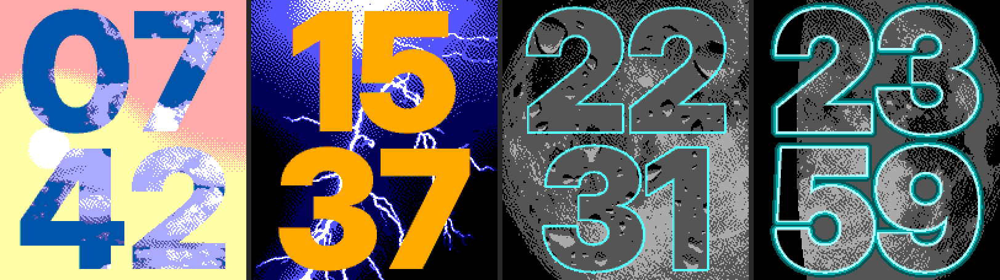
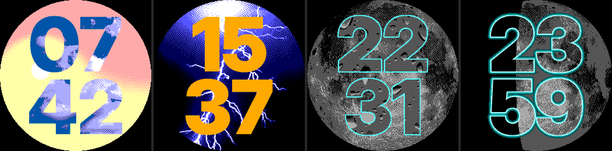

# Parallax Weather

A full-screen big-digit watch face for Pebble Time 2 (`emery`) and Pebble Round 2 (`gabbro`).
The four digits are windows cut through a plate and show the current weather behind them.
By day the plate is the real sky with the sun where it really is; at night it is the real
moon in its real phase. A setting (day and night separately) swaps the roles: the weather
becomes the background, moving with the tilt, and the digits turn a solid colour picked for it.





## What it shows

- **Day:** the sky's colour follows the sun's real elevation at your location (morning, midday,
  afternoon, golden hour), with a soft sun at its real position.
- **Night:** a photograph of the moon in its current phase, with a thin cyan border around the
  digits that becomes a glow while the backlight is on.
- **Weather:** sunny, partly cloudy, cloudy, rain, snow, storm and fog, from
  [Open-Meteo](https://open-meteo.com/) (no account or API key). Weather older than 3 hours shows
  as flat grey digits.
- **Tilt:** while the backlight is on, tilting the watch shifts the layers against each other.
- 12 or 24 hour time follows the phone's setting.

## Install

Download `parallax-weather-X.Y.Z.pbw` from the
[latest release](https://github.com/hornofabraxas/parallax-weather/releases/latest) and open it
with the Pebble app on your phone.

## Settings

Open the face's settings in the Pebble app. Each look is chosen by tapping a picture of it.

| Setting | Options | Default |
| --- | --- | --- |
| Day background | Sky, Weather | Weather |
| Sky style | Gradient, Solid | Gradient |
| Digit border (day) | Off, On | On |
| Night background | Moonphase, Weather | Moonphase |
| Tilt effect | On, Off | On |
| Weather refresh | 15, 30, 60 min | 30 min |
| Location | Automatic, Manual (latitude and longitude) | Automatic |

## Privacy

The phone uses your location for two things only: a weather request to Open-Meteo (latitude and
longitude rounded to 3 decimal places) and the sun and moon calculations, which run on the phone.
The last location and your settings are kept in the Pebble app's storage on the phone. Nothing
else leaves the phone, and the watch receives only small numbers (weather state, sun times, moon
phase, settings).

## Building

Requirements: [pebble-tool](https://github.com/coredevices/pebble-tool) with SDK 4.33, Python 3,
Node.js (tests only), a C compiler (host tests only).

```bash
pebble build
```

```bash
sh tools/run_tests.sh
```

The tests build the watch's drawing code for the host (`tools/host/`) and run the phone code's
tests with Node. `build/host/preview` renders any look to a PNG with the watch's own compositor;
its options are listed at the top of `tools/host/preview.c`.

The watch art in `resources/` is generated and committed. Regenerating it needs macOS (Swift,
CoreGraphics, CoreText): `tools/build_assets.sh`. The settings-page thumbnails come from
`tools/thumbs.py` (needs `cwebp`).

## Repository layout

| Path | Contents |
| --- | --- |
| `src/c/` | Watch C code: `engine` (compositor), `sky`, `moon`, `face` (portable), `main.c` (Pebble glue) |
| `src/pkjs/` | Phone side (PebbleKit JS): weather, sun and moon maths, settings page |
| `resources/` | Generated watch art; Round 2 files carry the `~gabbro` tag |
| `tools/face.swift` | Texture pipeline and design renderer (Swift, macOS only, no packages) |
| `tools/pack.py` | Packs the exported art into the watch's raw formats |
| `tools/host/` | Host build of the watch compositor: previews and unit tests |
| `tools/emu/` | Emulator helpers |
| `art/src/` | Source photographs |
| `art/fonts/` | Inter Display Black and its OFL licence |
| `docs/SPEC.md` | Design spec |
| `docs/ROADMAP.md` | Build notes, measurements and decisions |

## Licence and credits

The code is MIT licensed ([LICENSE](LICENSE)). The photographs and the textures made from them
keep their own licences (public domain, CC BY 2.0 and CC BY-SA 4.0), and the digits come from
Inter Display Black (SIL Open Font License 1.1). Every source, author and licence is listed in
[CREDITS.md](CREDITS.md), which also says what to credit when you redistribute the face.
